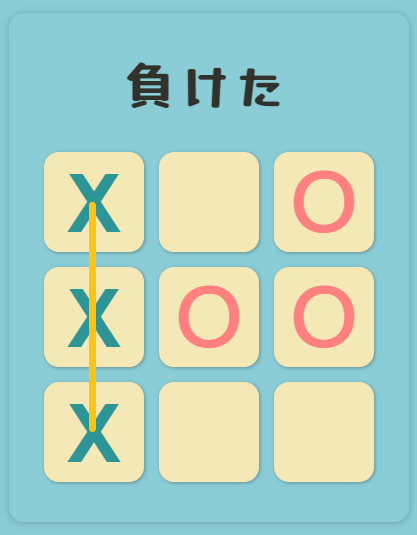

# 井字遊戲 Tic Tac Toe

能夠選擇先攻或後攻與電腦對戰。在遊戲結束時會出現勝利的連線及遊戲結束的宣告。
之後可以選擇"AGAIN"繼續遊戲。


### [DEMO 連結](https://tictactoe-tess.netlify.app/)

###### 畫面使用日文呈現，因為看起來比較可愛

## 設計過程

### 井字畫布如何呈現

教案使用 table 的方式搭配偽元素做到能在點擊後畫出 OX

```
1. Grid & Flex 應該會更有彈性。
2. 在長寬高都會寫死的狀況下，使用Flex可以快速輕易的把9個<div>元件排列成九宮格，因此選擇Flex做排版。

```

### 如何判斷輸贏

```
1. 井字遊戲的勝利條件總共只有8組，將8個組合全部記錄在Array裡。
2. 創造兩個Array用於紀錄兩位對戰者所下的位置。
3. 使用for of迴圈，每當有新的位置被推入對戰者的Array時則利用下方式驗證是否達到勝利條件
arr.every((num) => positionArr.includes(num))
```

### 電腦如何對戰

用人的思考邏輯去想，下在哪裡會贏。分析的越細，電腦就會越強。
一開始覺得只要把空格找出來，用隨機的方式讓電腦選位置就好，但這樣太弱了。

```
1. 不下這個位置就會輸。
2. 下了這個位置就會贏。
3. 最有利的中間位置。
4. 隨機。

```

用以上四個邏輯順序來安排電腦要下的位置。因此在開局時，若使用者選擇後下，則電腦一定會先搶正中間的位置。

### 遊戲結束的連線

如何找到贏家的三個位置?

```
做法: 設定一個全域變數winArray，每次在判斷是否勝利時，都把勝利的Array存進全域變數中。
當遊戲結束時，變數裡的Array就是勝利的Array。

```

如何畫線?

```
第一個嘗試使用一個div來設定線的樣式，並透過添加1~8個不同的class。
搭配postiton: absolute的位置調整來做到8條線的不同效果
```

除了顯示出線之外，還想做到從左畫到右的效果

```
使用transition搭配transform: scale的方式能做到。
但因為所有的class都作用在一個div上，造成position互相影響混亂的情況。
```

改成使用 8 個 div 來做

```
將需要add & remove的style寫在class裡，不會更動的樣式寫在[data]裡面，
就可以在後續做到用forEach一次清除掉所有的class。
```



## 使用工具

- JavaScript
- CSS & HTML
- Sass
