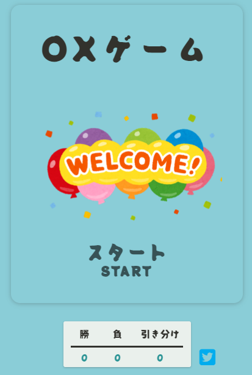

# 井字遊戲 Tic Tac Toe

使用 JavaScript 寫出的 MVC 架構井字小遊戲。
使用者能選擇先攻或後攻與電腦對戰。在遊戲結束時會出現勝利的連線及遊戲結束的宣告。之後可以選擇"AGAIN"繼續遊戲。有統計目前對戰分數功能，及將對戰結果即時發布在推特上的按鈕。

### [DEMO 連結](https://tictactoe-tess.netlify.app/)

###### 畫面使用日文&英文呈現

## 使用技術

- JavaScript 使用 MVC 架構寫成，將函式清楚劃分開，增加程式碼可讀性。
- 比起單純用隨機的方式，細部處理電腦對戰功能，因此很難贏過電腦。
- CSS 使用預處理器 SASS，善用 mixin 功能，減少重複程式碼。
- 應用 keyframes 製作勝利連線動畫，搭配 transform 的 rotate, scale 達到想要的效果。
- 考量行動裝置無法展現 hover 文字變色效果，更新加上點擊後文字閃爍動畫。

## 設計過程

### 井字畫布如何呈現

table、flex、grid 都能達到一樣的效果，在此選擇 Grid 的修改彈性較佳

### 如何判斷輸贏

1. 井字遊戲的勝利條件總共只有 8 組，將 8 個組合全部記錄在 Array 裡。
2. 使用兩個 Array 紀錄兩位對戰者所下的位置。
3. 使用 for of 迴圈，每當有新的位置被推入 Array 時就驗證是否包含勝利條件的 Array。
4. 同時使用 Array.entries()紀錄勝利 array，並呼叫相對應的勝利連線(1~8 條) CSS 效果。

### 電腦如何對戰

用人的思考邏輯去想，下在哪裡會贏。分析的越細，電腦就會越強。

1. 不下這個位置就會輸。
2. 下了這個位置就會贏。
3. 最有利的中間位置。
4. 隨機。

用以上四個邏輯順序來安排電腦要下的位置。因此在開局時，若使用者選擇後下，則電腦一定會先搶正中間的位置。

### 連線的劃線效果的困難點

除了顯示出連線之外，還想做到從左畫到右的效果。

1. 比起使用 transition keyframe 有更高的彈性。
2. transform 中 scale 與 rotate 排列的順序會影響呈現的效果。必須先 rotate 再 scale 才能達到效果

### iphone 上 CSS 跑版

當使用 Andriod 手機、Windows 電腦、Mac 電腦及 devTools 時，皆不會有任何 CSS 的異常。但多數 iphone 使用者回饋，在 iphone 上不論使用 Safari & Chrome 都會有按鈕大小異常的現象。

iOS 系統在 iphone 有一些無法預料的預設值，只能慢慢的 try & error，找出影響排版的 CSS 屬性。
問題從大的 playground board 限縮到小的 button，發現 font-size 是造成跑版的關鍵。將 font-size 屬性從 button 上移動到 button:after &button:before 即可修正問題。

### Twitter 分享按鈕

推特提供了多種與推特連動的方法，本次只需要將遊戲結果讓使用者發上推特，使用官方推出的特定連結，依照固定格式即可輕鬆連接。

## 使用工具

- JavaScript
- CSS & HTML
- Sass
